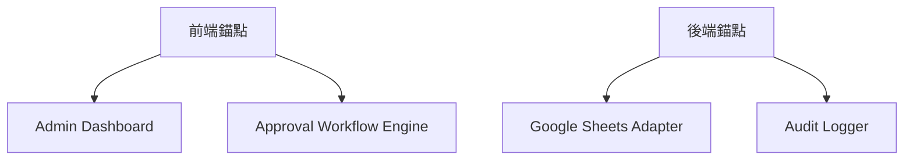
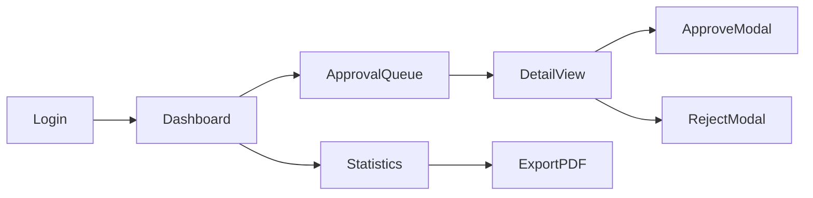
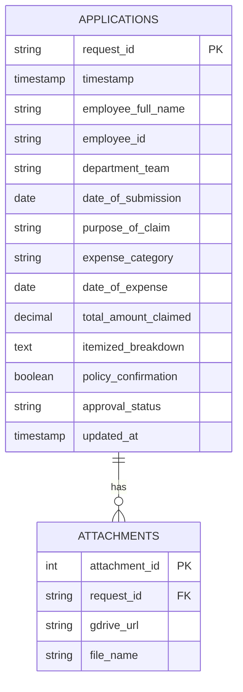

以下是完整的產品需求文檔（PRD），基於您的初始概念進行系統化擴展：

---

# 1. 項目概述與核心價值
**產品名稱**：ClaimMaster (暫定)  
**核心價值主張**：
- 數位化傳統紙本經費申請流程，消除實體文件傳遞的延遲
- 即時決策看板，提供校長「一鍵審批」的決策效率
- 全流程透明化，解決「申請進度黑箱」問題
- 歷史數據自動歸檔，取代人工整理Excel報表

**延伸發現的價值點**：
▶️ 系統自動計算各部門累計申請金額（超出預算時主動警示）
▶️ 簽核歷程存證功能（合規性需求）

---

# 2. 用戶畫像與使用場景
## 核心用戶類型
| 角色 | 痛點 | 高頻場景 |
|------|------|----------|
| 校長 | 需要隨地審批但手機無法操作PDF註解 | 每週五集中審批50+申請案時，需要過濾「急件」 |
| 行政助理 | 人工整理申請文件耗時易錯 | 發現申請表填寫不全時，需退回補件 |
| 申請人 (教師) | 不確定審批進度 | 提交後3天未獲回應時，查詢卡關環節 |

**關鍵場景示例**：
> 校長在國際會議期間收到緊急採購申請，透過手機登入系統後：  
> 1. 首頁「急件」標籤自動置頂顯示該案
> 2. 點擊申請後顯示「比價單」附件預覽
> 3. 滑動選擇「核准」並錄入語音備註
> 4. 系統即時同步狀態給申請人與會計室

---

# 3. 功能清單（MVP與延伸）
## MVP核心功能
- **申請看板**
  - 卡片式列表（含篩選：待處理/已核准/被拒絕）
  - 金額閾值標記（超過$10,000高亮顯示）
  - 一鍵下載當批次所有附件
- **決策操作**
  - 雙因素確認（避免誤觸拒絕按鈕）
  - 可選填拒絕原因模板（預設5種常用選項）
- **Google Sheet同步**
  - 雙向同步機制（系統修改後回寫sheet）
  - 衝突處理規則（最後修改優先）

## Nice-to-Have（Phase 1）
- 電子簽章模組（符合ISO/IEC 27001標準）
- 自動生成月度核銷報告PDF
- Line/Teams審批通知集成
- 預算餘額即時顯示（需連接會計系統API）

---

# 4. 模組錨定建議


---

# 5. 頁面結構圖


---

# 6. 數據結構建議
## 核心實體關係


---

# 7. Supabase數據庫配置指南
## 表結構SQL
```sql
-- 主申請表（根據實際 Google Form 欄位設計）
CREATE TABLE applications (
  id UUID PRIMARY KEY DEFAULT uuid_generate_v4(),
  timestamp TIMESTAMPTZ NOT NULL DEFAULT NOW(),
  employee_full_name TEXT NOT NULL,
  employee_id TEXT NOT NULL,
  department_team TEXT NOT NULL,
  date_of_submission DATE NOT NULL,
  purpose_of_claim TEXT NOT NULL,
  expense_category TEXT NOT NULL,
  date_of_expense DATE NOT NULL,
  total_amount_claimed NUMERIC(10,2) NOT NULL,
  itemized_breakdown TEXT,
  receipt_urls TEXT[], -- 存儲多個收據連結
  policy_confirmation BOOLEAN DEFAULT FALSE,
  approval_status TEXT DEFAULT 'PENDING' CHECK (approval_status IN ('PENDING','APPROVED','REJECTED')),
  rejection_reason TEXT,
  approved_by TEXT,
  approved_at TIMESTAMPTZ,
  updated_at TIMESTAMPTZ DEFAULT NOW()
);

-- 索引優化
CREATE INDEX idx_approval_status ON applications(approval_status);
CREATE INDEX idx_employee_id ON applications(employee_id);
CREATE INDEX idx_date_of_submission ON applications(date_of_submission);

-- Row Level Security策略
CREATE POLICY "Admin access" ON applications
  USING (auth.email() = 'headmaster@school.edu');

-- 自動更新時間戳
CREATE OR REPLACE FUNCTION update_updated_at()
RETURNS TRIGGER AS $$
BEGIN
  NEW.updated_at = NOW();
  RETURN NEW;
END;
$$ LANGUAGE plpgsql;

CREATE TRIGGER update_applications_updated_at
  BEFORE UPDATE ON applications
  FOR EACH ROW
  EXECUTE FUNCTION update_updated_at();
```

## 同步機制
1. 設置Google Sheets → Supabase的即時同步：
```bash
curl -X POST 'https://<SUPABASE_URL>/rest/v1/rpc/import_from_gsheet' \
-H "apikey: <SUPABASE_KEY>" \
-H "Content-Type: application/json" \
-d '{"sheet_id": "1aBcD..."}'
```

---

# 8. 非功能需求
| 類型 | 要求 | 驗收標準 |
|------|------|----------|
| 安全性 | 校長操作需2FA驗證 | Google Authenticator集成 |
| 性能 | 列表頁加載<1.5s | 200並發用戶測試 |
| 合規性 | 保留7年審計日誌 | 自動備份到S3 |

---

# 9. 開發優先級（Time-boxing）
| 任務 | 預計時間 | 風險提示 |
|------|----------|----------|
| Google Sheets API連接 | 90分鐘 | 需處理OAuth2.0 token刷新 |
| 校長決策流程原型 | 45分鐘 | 注意無效狀態轉換處理 |
| RLS策略測試 | 30分鐘 | 需模擬多角色帳號 |

---

**關鍵補充建議**：
1. 必須加入「防呆設計」：當拒絕申請時強制填寫原因（最少20字）
2. 意外發現需求：校長可能需要「批量核准」同類別小額申請
3. 隱藏痛點：系統需支援IE11（部分學校仍使用老舊系統）

**技術決策點**：
- 推薦使用Tiptap編輯器實現備註富文本功能
- 對於附件預覽，建議集成Office365 Viewer API
- 採用Server-Sent Events實現即時狀態更新

是否需要進一步深入探討任何部分？